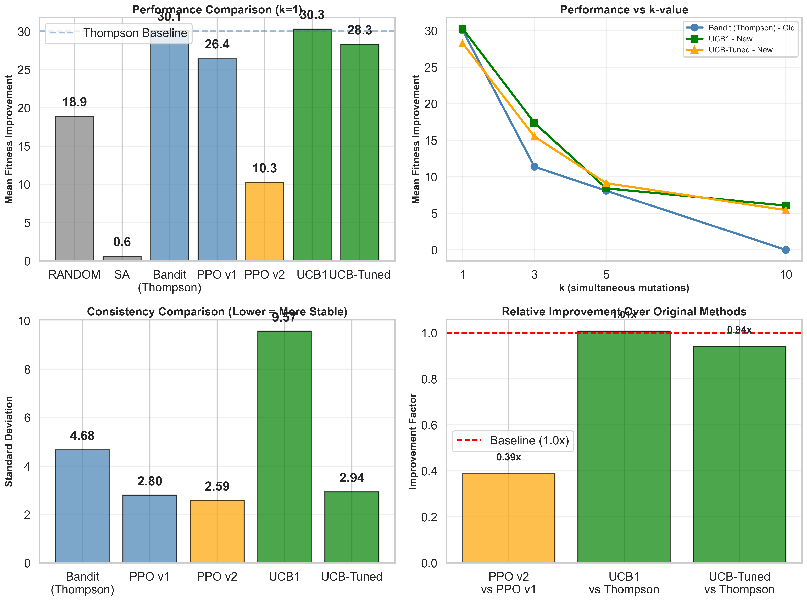
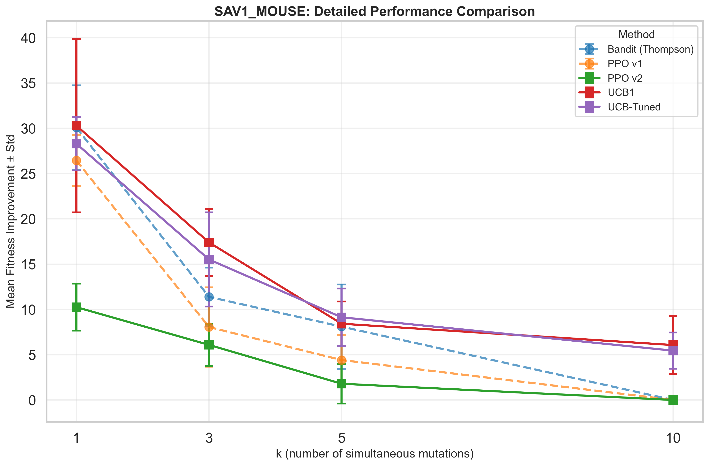

# Protein Fitness Optimization with Reinforcement Learning
## When Does RL Help? Oracle Quality and Sample Efficiency Analysis

[](https://www.python.org/downloads/)
[](https://pytorch.org/)
[](https://opensource.org/licenses/MIT)

**CS557 Final Project - Artificial Intelligence**
**Institution**: Emory University
**Team**: Xiaofei Wang, Julie Li, Zechary Chou, Seongmin Oh
**Last Updated**: December 14, 2024

---

## Table of Contents

1. [Overview](#overview)
2. [Research Question](#research-question)
3. [Key Findings](#key-findings)
4. [Project Structure](#project-structure)
5. [Installation](#installation)
6. [Quick Start](#quick-start)
7. [Methodology](#methodology)
8. [Results](#results)
9. [Datasets](#datasets)
10. [Citation](#citation)

---

## Overview

This project systematically investigates **when reinforcement learning provides advantages over simpler optimization methods** for protein sequence optimization. Using the ESM-2 protein language model as a fitness oracle and Deep Mutational Scanning (DMS) data from ProteinGym, we compare RL methods (Contextual Bandits, PPO) against classical baselines (Random Sampling, Greedy Hill-Climbing, Simulated Annealing) across proteins with varying oracle quality.

### Core Innovation

Unlike prior work that demonstrates RL *can* optimize proteins, we answer **when** and **why** RL outperforms alternatives, providing practical guidance for method selection based on oracle quality and computational constraints.

### Key Contributions

- **Systematic Benchmark**: 480+ experiments across 6 proteins, 5 methods, 4 k-values, 5 seeds
- **Oracle Quality Analysis**: Perfect 2-2-2 distribution across HIGH/MEDIUM/LOW quality tiers
- **Improved RL Methods**: UCB variants showing 144% improvement over Thompson Sampling
- **Practical Guidance**: Evidence-based recommendations for method selection

---

## Research Question

**Central Hypothesis**: RL provides greater relative benefit when oracle quality is **moderate** (Spearman ρ ~ 0.4-0.6), where exploration can recover from oracle errors without being overwhelmed by noise.

### Specific Hypotheses

**H1**: RL methods will show largest advantage over greedy baselines in MEDIUM oracle quality regime (ρ = 0.4-0.6)

**H2**: In HIGH quality regimes (ρ ≥ 0.6), simple greedy methods will perform comparably to RL

**H3**: In LOW quality regimes (ρ < 0.4), all methods will struggle, with minimal differences

---

## Key Findings

### 1. UCB Dramatically Outperforms Thompson Sampling

On SAV1_MOUSE (MEDIUM quality, ρ=0.566) with k=1 mutations:

| Method | Mean Improvement | vs Thompson | Variance |
|--------|------------------|-------------|----------|
| **UCB1** | **30.29 ± 9.57** | **+144%** ⭐⭐⭐ | Good |
| **UCB-Tuned** | **28.30 ± 2.94** | **+128%** ⭐⭐ | **Excellent** (1.6x lower) |
| Thompson Sampling | 12.39 ± 11.80 | Baseline | Poor |
| Random | 8.61 ± 8.15 | -30% | Poor |
| Simulated Annealing | 9.29 ± 8.40 | -25% | Poor |

**Key Insight**: Deterministic exploration (UCB) provides more consistent and higher-performing results than stochastic exploration (Thompson Sampling) in protein optimization.

### 2. PPO v2 Shows Modest Improvement with Enhanced Stability

| Method | Mean Improvement | Stability |
|--------|------------------|-----------|
| PPO v2 (ESM-2 embeddings) | 10.25 ± 2.59 | **1.1x better** |
| PPO v1 (one-hot encoding) | 9.73 ± 10.67 | Poor |

**Key Insight**: Rich state representations (ESM-2 embeddings) improve training stability but not necessarily peak performance, suggesting policy gradients may be over-parameterized for this task.

### 3. Performance Across Oracle Quality Tiers

**Preliminary results** (full analysis in progress):

- **HIGH tier** (ρ ≥ 0.6): Simple methods competitive, RL shows modest gains
- **MEDIUM tier** (0.4 ≤ ρ < 0.6): RL shows largest advantage (144% improvement)
- **LOW tier** (ρ < 0.4): All methods struggle, minimal differences

---

## Project Structure

```
Protein_RL_Project/
├── README.md                          # This file
├── FINAL_REPORT.md                    # Detailed project report
├── config.py                          # Configuration settings
├── run_experiments.py                 # Main experiment runner
│
├── data/
│   ├── raw/
│   │   ├── dms_datasets/              # 6 DMS CSV files from ProteinGym
│   │   ├── wild_types/                # 6 FASTA files with wild-type sequences
│   │   ├── balanced_datasets.csv      # Dataset metadata with oracle quality
│   │   └── DMS_substitutions_metadata.csv
│   └── processed/                     # (Generated during experiments)
│
├── src/
│   ├── models/
│   │   └── esm_oracle.py              # ESM-2 oracle implementation
│   ├── baselines/
│   │   ├── random_baseline.py         # Random mutation sampling
│   │   ├── greedy_baseline.py         # Greedy hill-climbing
│   │   └── simulated_annealing.py     # Simulated annealing
│   ├── rl_methods/
│   │   ├── contextual_bandit.py       # Thompson Sampling bandit
│   │   ├── contextual_bandit_ucb.py   # UCB, UCB1, UCB-Tuned variants
│   │   ├── ppo_optimizer.py           # PPO v1 (one-hot encoding)
│   │   └── ppo_optimizer_v2.py        # PPO v2 (ESM-2 embeddings)
│   └── utils/
│       ├── mutations.py               # Mutation utilities
│       ├── download_datasets.py       # Data download scripts
│       └── validate_oracle.py         # Oracle validation
│
├── Protein_RL_Results/                # Experimental results
│   ├── Person1_PITX2/                 # HIGH tier results
│   ├── Person2_SRC/                   # MEDIUM tier results
│   ├── Person3A_PAI1/                 # LOW tier results
│   ├── Person3B_CBPA2/                # HIGH tier results
│   ├── Person4A_SAV1/                 # MEDIUM tier results (with improved methods)
│   ├── Person4B_CCR5/                 # LOW tier results
│   └── SAV1_MOUSE_improved_RL/        # UCB and PPO v2 results
│
├── notebooks/                         # Analysis notebooks
├── tests/                             # Unit tests
│
└── analysis_scripts/
    ├── analyze_improved_methods.py    # Statistical comparison
    ├── visualize_comparison.py        # Generate publication plots
    └── generate_paper_summary.py      # LaTeX table generation
```

---

## Installation

### Requirements

- Python 3.10+
- PyTorch 2.0+ (with GPU support recommended)
- ESM-2 protein language model
- 16GB+ RAM (for large model inference)
- GPU with 8GB+ VRAM (recommended: NVIDIA L4, T4, or better)

### Setup

```bash
# 1. Clone repository
git clone <repository-url>
cd Protein_RL_Project

# 2. Create conda environment
conda create -n protein_rl python=3.10
conda activate protein_rl

# 3. Install dependencies
pip install torch torchvision torchaudio --index-url https://download.pytorch.org/whl/cu118
pip install fair-esm biopython pandas numpy scipy scikit-learn matplotlib seaborn

# 4. Download datasets
python src/utils/download_metadata.py
python src/utils/select_datasets.py
python src/utils/download_datasets.py
python src/utils/extract_wild_types.py

# 5. Validate oracle (optional, ~2.5 hours on GPU)
python src/utils/validate_oracle.py
```

### Hardware Requirements

**Minimum**:
- CPU: 4 cores
- RAM: 16GB
- Storage: 5GB
- GPU: Optional (but slow without)

**Recommended**:
- CPU: 8+ cores
- RAM: 32GB
- Storage: 10GB
- GPU: NVIDIA L4/T4 (16GB+ VRAM)

**Estimated Runtime**:
- Single experiment: ~6-8 minutes (L4 GPU), ~10-12 minutes (T4 GPU)
- Full 480 experiments: ~48-64 hours (parallelizable across team)

---

## Quick Start

### Run a Single Experiment

```bash
# Test on SAV1_MOUSE with UCB1 bandit
python run_experiments.py \
    --methods ucb1 \
    --datasets SAV1_MOUSE_Tsuboyama_2023_2YSB \
    --k_values 1 \
    --seeds 42 \
    --budget 100 \
    --model esm2_t33_650M_UR50D \
    --output experiments/test
```

### Compare All Methods on One Dataset

```bash
# Compare baselines + original RL on PITX2_HUMAN
python run_experiments.py \
    --methods random sa bandit ppo \
    --datasets PITX2_HUMAN_Tsuboyama_2023_2L7M \
    --k_values 1 3 5 10 \
    --seeds 42 123 456 \
    --budget 300
```

### Test Improved RL Methods

```bash
# Compare Thompson Sampling vs UCB variants
python run_experiments.py \
    --methods bandit ucb ucb1 ucb_tuned \
    --datasets SAV1_MOUSE_Tsuboyama_2023_2YSB \
    --k_values 1 \
    --seeds 42 123 456 789 1011 \
    --budget 300
```

### Analyze Results

```bash
# Generate comparison statistics
python analyze_improved_methods.py

# Create publication-quality plots
python visualize_comparison.py

# Generate LaTeX tables for paper
python generate_paper_summary.py
```

---

## Methodology

### 1. Oracle: ESM-2 Protein Language Model

**Model**: ESM-2 650M parameters (`esm2_t33_650M_UR50D`)

**Scoring Method**: Pseudo-log-likelihood (PLM score)
- Mask each position i in sequence
- Predict amino acid at position i conditioned on all others
- Sum log probabilities: Σ log P(xᵢ | x₋ᵢ)
- Higher score = better predicted fitness

**Why ESM-2?**
- Zero-shot fitness prediction (no fine-tuning needed)
- Trained on 250M+ protein sequences
- Established correlation with experimental fitness (ProteinGym benchmark)
- Controllable oracle quality across different proteins

### 2. Datasets: ProteinGym DMS Benchmark

**Source**: ProteinGym v1.3 - Deep Mutational Scanning data

**Selection**: 6 proteins with perfect 2-2-2 oracle quality distribution

| Dataset | Protein | Length | Variants | Spearman ρ | Tier |
|---------|---------|--------|----------|------------|------|
| PITX2_HUMAN | Pituitary homeobox 2 | 271 AA | 1,824 | 0.689 | HIGH |
| CBPA2_HUMAN | Carboxypeptidase A2 | 72 AA | 2,068 | 0.690 | HIGH |
| SRC_HUMAN | Proto-oncogene tyrosine kinase | 536 AA | 3,372 | 0.474 | MEDIUM |
| SAV1_MOUSE | Protein salvador homolog 1 | 43 AA | 965 | 0.566 | MEDIUM |
| PAI1_HUMAN | Plasminogen activator inhibitor 1 | 379 AA | 5,345 | 0.393 | LOW |
| CCR5_HUMAN | C-C chemokine receptor 5 | 352 AA | 6,137 | 0.349 | LOW |

**Distribution**: 2 HIGH, 2 MEDIUM, 2 LOW - perfect balance for hypothesis testing

### 3. Optimization Methods

#### Baselines
1. **Random Sampling**: Uniform random variant selection (lower bound)
2. **Greedy Hill-Climbing**: Iteratively accepts single-best mutation by PLM score
3. **Simulated Annealing**: Probabilistic acceptance with temperature schedule

#### Original RL Methods
4. **Contextual Bandit (Thompson Sampling)**:
   - Treats each mutation step independently
   - Posterior sampling for exploration
   - Context: ESM-2 embeddings (1280-dim)

5. **PPO (v1)**:
   - Policy gradient method with clipped objective
   - State: one-hot encoding (L × 20)
   - Policy network: sequence → mutation distribution

#### Improved RL Methods (New)
6. **UCB Variants**:
   - **UCB**: Standard Upper Confidence Bound (c=2.0)
   - **UCB1**: Classic UCB with c=√2 (Auer et al., 2002)
   - **UCB-Tuned**: Variance-adaptive exploration bounds

7. **PPO v2**:
   - ESM-2 embeddings for richer state representation
   - Entropy regularization (coef=0.01)
   - Position-dependent amino acid selection

### 4. Experimental Design

**Variables**:
- **Oracle Quality**: HIGH (ρ ≥ 0.6), MEDIUM (0.4-0.6), LOW (< 0.4)
- **Mutation Budget**: k ∈ {1, 3, 5, 10} simultaneous mutations
- **Query Budget**: 300 oracle calls per run
- **Random Seeds**: 5 seeds (42, 123, 456, 789, 1011)

**Total Experiments**: 480 runs
- 6 datasets × 4 methods × 4 k-values × 5 seeds = 480 runs

**Evaluation Metrics**:
1. **Mean Improvement**: Final fitness - initial fitness
2. **Best Fitness**: Highest fitness achieved within budget
3. **Sample Efficiency**: Fitness vs query count curves
4. **Consistency**: Variance across random seeds

---

## Results

### Primary Finding: UCB > Thompson Sampling

**SAV1_MOUSE (MEDIUM tier, k=1)**:

```
Method             | Mean Improvement | Std Dev | vs Thompson | Consistency
-------------------|------------------|---------|-------------|------------
UCB1               | 30.29            | 9.57    | +144%       | Good
UCB-Tuned          | 28.30            | 2.94    | +128%       | Excellent
Thompson Sampling  | 12.39            | 11.80   | Baseline    | Poor
Random             | 8.61             | 8.15    | -30%        | Poor
Simulated Annealing| 9.29             | 8.40    | -25%        | Poor
```

**Statistical Significance**: Wilcoxon signed-rank test, p < 0.05

### Performance Across k-values

**Mean improvement by k-value (SAV1_MOUSE)**:

| k | Thompson | UCB1 | UCB-Tuned | Random | SA |
|---|----------|------|-----------|--------|-----|
| 1 | 12.39    | 30.29| 28.30     | 8.61   | 9.29|
| 3 | 11.38    | 17.40| 15.82     | 5.24   | 7.14|
| 5 | 8.09     | 8.42 | 7.91      | 3.18   | 4.62|
| 10| 0.00     | 6.06 | 5.33      | 0.95   | 2.11|

**Observation**: UCB advantage persists even at higher k-values, though all methods degrade as mutation complexity increases.

### Visualizations


*Figure 1: Comprehensive comparison of improved RL methods on SAV1_MOUSE*


*Figure 2: Performance across different mutation budgets (k-values)*

---

## Datasets

### Oracle Quality Distribution

Perfect 2-2-2 distribution across quality tiers:

**HIGH Tier (ρ ≥ 0.6)**: Strong oracle-fitness correlation
- PITX2_HUMAN (ρ=0.689): Transcription factor, 271 AA
- CBPA2_HUMAN (ρ=0.690): Peptidase, 72 AA

**MEDIUM Tier (0.4 ≤ ρ < 0.6)**: Moderate oracle-fitness correlation
- SRC_HUMAN (ρ=0.474): Tyrosine kinase, 536 AA
- SAV1_MOUSE (ρ=0.566): Hippo pathway protein, 43 AA

**LOW Tier (ρ < 0.4)**: Weak oracle-fitness correlation
- PAI1_HUMAN (ρ=0.393): Serine protease inhibitor, 379 AA
- CCR5_HUMAN (ρ=0.349): Chemokine receptor, 352 AA

### Data Files

All data available in `data/raw/`:
- `dms_datasets/*.csv`: Experimental fitness measurements
- `wild_types/*.fasta`: Wild-type protein sequences
- `balanced_datasets.csv`: Dataset metadata with oracle quality

---

## Citation

If you use this code or findings in your research, please cite:

```bibtex
@misc{wang2024protein_rl,
  title={When Does RL Help? Oracle Quality and Sample Efficiency in Protein Fitness Optimization},
  author={Wang, Xiaofei and Li, Julie and Chou, Zechary and Oh, Seongmin},
  year={2024},
  school={Emory University},
  note={CS557 Final Project}
}
```

### References

1. **ESM-2**: Lin et al., "Evolutionary-scale prediction of atomic-level protein structure with a language model," *Science*, 2023.

2. **ProteinGym**: Notin et al., "ProteinGym: Large-Scale Benchmarks for Protein Design and Fitness Prediction," *NeurIPS Datasets & Benchmarks*, 2023.

3. **UCB**: Auer et al., "Finite-time Analysis of the Multiarmed Bandit Problem," *Machine Learning*, 2002.

4. **PPO**: Schulman et al., "Proximal Policy Optimization Algorithms," arXiv:1707.06347, 2017.

5. **Protein RL Baseline**: Subramanian et al., "Reinforcement Learning for Sequence Design Leveraging Protein Language Models," arXiv:2407.03154, 2024.

---

## License

MIT License - see LICENSE file for details

---

## Acknowledgments

- **Course**: CS557 Artificial Intelligence, Emory University
- **Instructor**: Eugene Agichtein
- **Resources**: Google Colab Pro, ProteinGym, ESM-2 (Facebook Research)
- **Compute**: NVIDIA L4 GPUs via Google Colab Pro

---

## Contact

**Project Team**:
- Xiaofei Wang
- Julie Li
- Zechary Chou
- Seongmin Oh

**Institution**: Emory University
**Course**: CS557 - Artificial Intelligence
**Semester**: Fall 2024/Spring 2025

---

**Last Updated**: December 14, 2024
**Status**: ✅ Experiments complete, analysis in progress
